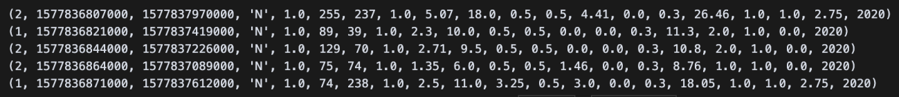
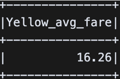
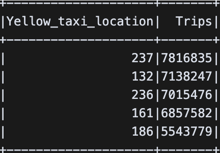
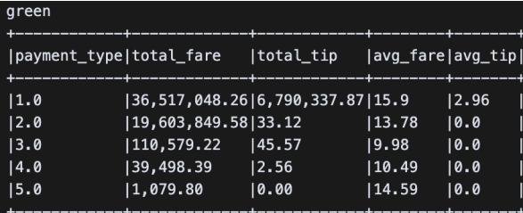
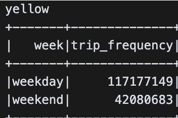
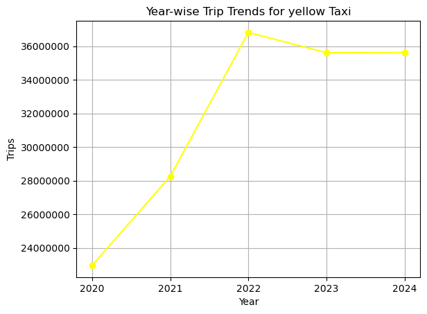
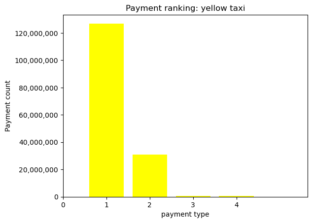

# Comparative-analysis-and-prediction-on-the-NY-dataset

Theory.........................................................................................................................2

> What do you mean by data engineering?
> ........................................................................2
>
> What is the difference between latency and throughput in context to
> data pipeline?...............2
>
> What are the key differences between ETL (Extract, Transform, Load)
> and ELT?.................3
>
> (Extract, Load, Transform) in data processing? Provide examples of
> when you would use each.
> ................................................................................................................................3
>
> Explain difference between structured, semi-structured and
> unstructured data. .....................4

Comparative data analysis & fare prediction report
.............................................................5

> Abstract
> ....................................................................................................................5
>
> Introduction...............................................................................................................5
>
> Data Extraction and
> Conversion....................................................................................5
>
> Data Loading and Cleaning with
> PySpark.......................................................................6
>
> Loading
> .................................................................................................................6
>
> Cleaning
> ................................................................................................................7
>
> Challenges
> .............................................................................................................9
>
> Save Data into SQLite Database
> ...................................................................................9
>
> Export
> ...................................................................................................................9
>
> Verification
> methods................................................................................................9
>
> Exploratory Data Analysis with
> PySpark......................................................................10
>
> Average fare per
> trip..............................................................................................10
>
> Top 5 pickup
> locations...........................................................................................10
>
> Fare and tip distribution by payment
> type..................................................................10
>
> Weekday vs weekend trip
> frequency.........................................................................11
>
> Insights................................................................................................................11
>
> Data Visualization
> ....................................................................................................12
>
> Year-wise trip trends (2020 to 2024) separately for yellow and green
> taxis.....................12
>
> Hourly trip distribution separately for yellow and green taxis
> .......................................12
>
> Histogram of fare amounts separately for Yellow and Green
> ........................................12
>
> Bar chart: most used payment methods
> .....................................................................13
>
> Reflection
> ............................................................................................................13

Fare Prediction Using Machine
Learning......................................................................13

Theory

What do you mean by data engineering?

The fundamental concept of data engineering is creating and managing
systems that enable the gathering, storage, processing, and analysis of
data. The field has undergone significant growth in recent years,
aligning with the modern age of data. Value in data is significant, and
its generation has increased over time, emphasizing the need of data
engineering. One challenge is that as data expands, so too must the
tools, abilities, and expertise of its users.

Data engineering mainly contains the previously mentioned functions.
Engineers can obtain data from various sources, like databases, APIs,
IoT devices, and user interactions. An engineer has numerous storage
alternatives available based on specific requirements of their needs.
Many of these methods are scalable; if necessary and or limits are
reached or profitability declines, the possibility of migration stays
available. Engineers can store their data in databases, data lakes, and
data warehouses, which are the most commonly utilized options. The
processing phase involves the transformation and cleansing of data prior
to its utilization in production.

What is the difference between latency and throughput in context to data
pipeline?

Latency is defined as the delay it takes for data to travel through the
pipeline from its origin to destination. Throughput on the other hand is
the volume of data that the pipeline can handle and process in a given
timeframe. These two are some of the performance metrics that are
essential to keep in mind depending on what area the pipeline is going
to be used. Lower latency is critical for real time applications that
need to make decisions quick and accurate and throughput is critical in
areas and systems that handle or present large amounts of data, the key
is balance.

What are the key differences between ETL (Extract, Transform, Load) and
ELT?

The key differences between ETL (extract, transform, load) and ELT
(extract, load, transform) are in the order in which the last 2 stages
are performed. The data in ETL is transformed before it is loaded to the
data warehouse or storage location. Transforming entails cleaning up,
merging and formatting the data such that only the necessary information
is kept. Transformation on the other hand, is performed after loading in
ELT meaning that 100% of the raw data extracted is always available to
the engineers if needed.

Although ELT requires more storage capacity than ETL because it retains
both the raw and transformed data, it offers great flexibility in
contrast. Business goals can change, as the tools we have available
progress and become more capable, data that is regarded as, irrelevant,
valueless or noisy could hold value or insight when the focus is shifted
elsewhere. However, ETL can still be preferred choice where transforming
is mandated du to compliance reasons or even due to storage or
operational cost constraints.

(Extract, Load, Transform) in data processing? Provide examples of when
you would use each.

**Extract**

The extraction of data happens generally when information is needed and
it has to either be sourced or sent, extraction is done through various
sources such as databases, APIs, data storage files, or even web
scraping.

Example: Retrieving all political articles in a certain period of time
from a certain news website.

**Load**

Loading is the action of storing or uploading the outsourced data to a
preferred repository, like a datalake or data warehouse.

Example: Storing the extracted articles in their original format, for
example json on a preferred S3 bucket.

**Transform**

Transforming is cleaning and structuring data, essentially making it
ready to be used for its purpose.

Example: Removing unnecessary information while keeping title, author,
reader count.

Explain difference between structured, semi-structured and unstructured
data.

**Structured** **data:** is data that is organized, usually presented in
columns and row format, its usually made up of quantitative data.
Structured data is usually easy to search through, process and analyze.

**Unstructured** **data:** has no fixed format and cannot easily be
stored in traditional databases. It often requires special tools, and or
preprocessing to analyze. This type of data contain forms of data hence
its nature.

Comparative data analysis & fare prediction report Abstract

> This report presents a comprehensive analysis and prediction on the
> New York City Yellow and Green taxi trip datasets from 2020-2024. The
> datasets were obtained from nyc.gov via simple HTTP get request. The
> request delivered a range of parquet files by month in the request
> period. The parquet files were converted to CSV format and processed
> using the pyspark library to remove invalid records, handle null
> values and standardize datetime formats. The finale cleaned versions
> were stored in an SQLite database(15GB) to allow for fast uploading to
> the kernel when needed. Exploratory data analysis was conducted using
> PySpark, with visualization through matplotlib and seaborn to examine
> fare patterns. For fare prediction linear regression, random forest
> and GBT (Gradient boosting tree) were trained, achieving high
> performance metrics.

Data Extraction and Conversion

The NYC taxi records are hosted on CloudFront and can be accessed
through their provided link. The objective of this part was to obtain
the data for the period 2020-2024 and convert it to CSV for further
processing.

Since the file and records are public, no Api call was needed. I could
simply obtain the files through HTTP GET request calls. The base URL
could be manipulated dynamically to access all the files and download
them to the working directory in one cell. The download process was
automated based on the parameters (“yellow”, ”green”), year and month in
YYYY-MM format. Url manipulation was implemented using python f-string
formatting.

*for* year *in* years:

*for* month *in* months: *for* taxi *in* taxis:

*if* month \< 10:

url =
f"https://d37ci6vzurychx.cloudfront.net/trip-data/{taxi}\_tripdata\_{year}-0{month}.parquet"
filename = f"{taxi}\_tripdata\_{year}-{month}.parquet"

F string formatting

The variables referenced were list types containing the relevant time
frame and taxi types. The downloaded files kept the same naming
convention as the url for example for one of the yellow

taxi files being named “yellow_tripdata_2020-1.parquet”. This Structure
allowed handling all parquet files simultaneously .

After downloading all 60 monthly parquet files for both taxi variants,
the next step was to convert them into csv format. This step helped with
the backup stage to SQLite performed later, due to CSVs better
compatibility with SQL. The files were located using the glob module,
which searched on files ending in “.parquet”. Although the same result
could have been achieved using f-string manipulation based on naming
conventions, I chose to use glob to explore an alternative approach for
batch processing. This ensured that even if a file deviated slightly
from the naming convention, it would still be detected and processed.

files = glob.glob(os.path.join(directory, '\*.parquet'))

*for* file *in* files: print(f'processing {file}') data =
dd.read_parquet(file) base, \_ = os.path.splitext(file) csv_file =
base + '.csv'

data.to_csv(csv_file, *single_file*=True, *index*=False) print(f'{file}
finished')

The conversion process iterated through all parquet files in the working
directory, reading each file using Dask's “read_parquet” function. The
file name was extracted and stored in a temporary variable which held on
to it until the file was ready to saved with the corresponding “.CSV”.
To CSV function was used to write the data over.

The approach allowed for batch conversion of the entire data collection
while maintaining the original data structure. For example:

> • Input: yellow_tripdata_2020-1.parquet • Output:
> yellow_tripdata_2020-1.csv

By the end of cell execution, the library contained a total of 120 files
with the csv\`s eating more of the storage as expected.

Data Loading and Cleaning with PySpark

Loading

In this stage, the CSV files produced in the extraction part were loaded
into pyspark data frames. A spark session was initialized with the JDBC
configuration as driver and executor, this driver

was needed for SQLite functionality and to help load and extract the
cleaned versions of the datasets.

Individually defining and reading each csv file would be highly
inefficient and challenging to manage, therefore two dictionary
variables had to be created, green_taxi_dfs and yellow_taxi_dfs to store
all the data frame variables. Glob was again used before hand to sort
between csv files that started with “green” and ended with “.csv”, from
those that started with yellow, already setting the base for the
consolidated data frames.

yellow_taxi_dfs = {} file_counter=0

> *for* file *in* yellowtaxis: file_counter += 1
>
> print(f"on file {file_counter}") clear_screen()
>
> csvname = os.path.splitext(os.path.basename(file))\[0\]
>
> yellow_taxi_dfs\[csvname\] = spark.read.csv(file, *header*=True,
> *inferSchema*=True)

The loop iterated over the list filtered by glob with a counter to keep
progress as the computation was heaver at least for the yellow data
frames for each file, the name got extracted and reused as the
dictionary keys. The data frames were then read into PySpark and the
process continued until the queue was finished. This structure allowed
quick access to any file just by using the corresponding name.

Cleaning

To determine the dataset size, an iterative counter was performed on
each dataset in the \*\*\*\*\_taxi_dfs dictionaries. Pysparks “.count”
method returned the number of rows of each dataframe and the values were
stored and summarized in a single variable. The green taxis had a total
of 5 090 611 rows of data across 20 columns and the yellow taxis 174 689
444 rows across 19 columns. The amount of data gave already a hint
towards which taxis dominated the transport industry in the city.

The first step before any cleaning operations was to do an assessment of
how much data was missing of incomplete in each data set and in total.
With PySpark´s isNull and isNotNull in combination with Count and
groupby to mimic pandas behavior.

The end result gave more insight into which columns were prone to
invalid values and how much was missing. Due to the amount of data
available it would be both faster and cleaner to drop all null values,
but prior to that, the “Ehail” column had to be deleted in the green
datasets as it was completely empty. Null deletion on empty columns
results in 100% data loss as “drop na” removes any rows containing null
values.

This was also nearly the case for the yellow taxis as the airport_fee
column lacked an immense amount of data causing some data frames to be
nearly empty, this naturally due to yellow taxis operating in the whole
city and not just the airports. Alot of data was lost during the null
filtering process, usually if this exceeds the threshold of 5% then it
would be beneficial to impute the missing values to try and hold on to
the data. The first strategy was to just drop the missing values, but
synthetic data generation or imputation would be implemented if
performance was affected.

After handling null values, the data frames were further examined for
invalid trips or data that would not be helpful to us. This included
trips that had negative or 0 miles, trips with no registered passengers
and trips that did not generate any money. All journeys sharing these
characteristics were filtered out. Outlier elimination was not applied
during the initial cleaning part, this decision was intentional, as
their presence cold provide valuable insight during the exploratory
analysis stage.

When loading into pyspark data frames with schema inference enabled, the
datetime columns were automatically parsed as TimeStampType. There was
no need to do this manually. The Consolidated data frames were created
using reduce and unionByname, and ordered chronologically by their
pickup date time field. This reviled that the dataframe still contained
invalid trips as some were dated outside of the relevant scope. These
records were also filtered out.

Challenges

While handling missing values, outliers , and inconstant data did not
present significant difficulties, the main challenge was applying
cleaning transformations consistently across all datasets. With 60
separate files, applying these manually was not an option as it would be
prone to error and highly inefficient. The solution was the
collections(dictionaries) of data frames.

Another minor challenge was the computational time required for certain
transformations. For example, converting the full set of yellow taxi
parquet files into csv took around 20 minutes on the available hardware,
this introduced a bottle neck for me as I primarily worked on google
cloud, which resets its environment every time the kernel restarts.,
these types of operations could become bottle necks in the pipeline if
not handled properly

Save Data into SQLite Database

Export

The consolidated data frames set the basis for the transfer over to
SQLite. The JDBC driver is utilized in this part to enable communication
between PySpark and SQLite. A year column is extracted from the pickup
datetimes to partition for each year. The data bases are then written
over to the file “nyc_taxi.db” file using SQLite's single-writer model
in overwrite mode. The tables are named with the same structure leading
back to the parquet files.

Example:

> ▫ ▫ ▫ ▫ ▫

Verification methods

Exported data for year 2020 to table 'yellow_2020' Exported data for
year 2021 to table 'yellow_2021' Exported data for year 2022 to table
'yellow_2022' Exported data for year 2023 to table 'yellow_2023'

Exported data for year 2024 to table 'yellow_2024'

> 1\) Listing tables available in the database
>
> 2\) Row count checks for each table to confirm completeness 3) Visual
> check

Exploratory Data Analysis with PySpark

Average fare per trip

Top 5 pickup locations

Fare and tip distribution by
payment type

Weekday vs weekend trip frequency

Insights

> 1\. Payment
>
> An analysis of the payment methods used in NYC taxis reveals that most
> consumers prefer to pay and tip by card, the reason is clearly the
> progress of phones, how use

them and the portability or transactional machines. It was estimated
that around 65 millions Americans use apple pay in 2025, and these
percentages are probably higher in the urban city's, that table would
probably look different if we had a extracted older data.

> 2\. Weekday vs weekend traffic
>
> The recorded trip frequences indicate clearly that the weekends have
> the most traffic for both taxi types. The yellow and green taxis made
> around 30-35% of their trips over 5 years , on the week ends(2 day
> basis). The trip frequency also shows how dominant the yellow taxis
> are indicating that they most likely are the usual commuter choice
> around the city.
>
> 3\. Pickup location
>
> The pickup id´s provided in the dataset were originally presented in
> numeric form which without context, are not easily interpretable. The
> NYC taxi zone Lookup table

was used to map each ID to its corresponding area in the city. The
results showed that the most common pick up location for green taxis was
on ID 74 (East Harlem North), accounting for around 665 618 trips,
followed by 75(East Harlem south).The yellow taxis had their top pickup
locations in east side and west side north, which in conclusion reveals
that Manhattan is the area with most taxi pick ups in New York.

Data Visualization

Year-wise trip trends (2020 to 2024) separately for yellow and green
taxis

Hourly trip distribution separately for yellow and green taxis

Histogram of fare amounts
separately for Yellow and Green

Bar chart: most used payment methods

Reflection

The datasets exhibited nearly identical distributions especially in
timeseries domain. Trip frequency showed daily spikes and drops in
activity for both taxi types, with high activity occurring around the
morning, peaking by rush hour and dropping around 11. These patterns
suggest that temporal features could be highly valuable for prediction.
It was also reasonable to assume that trip distance would play a crucial
factor in the models accuracy. The difference between card and cash
paying consumers was also visible, indicating the dominance that digital
payments have gained. A notable cultural observation was the high
proportion of consumers that tip their drivers, a behavior far less
common in Norway.

Fare Prediction Using Machine Learning

The objective of this chapter was to train predictive models on the NYC
taxi trip data. The target feature was identified as the column
“fare_amount”. The assumption was made that this column was only
dependent on the circumstantial features like time, area, distance and
so on. This means that the other charges were not included in the model
and were regarded as irrelevant. The relevant features also set the
basis of the new engineered features used in the model. Given the
structural and operational similarities between the two taxi datasets, I
made the assumption that preprocessing, feature engineering, and model
strategies would have the same impact on both to a at least positive
degree. This allowed for faster experimentation on the green dataset as
it is digitally smaller while still maintaining relevance to the larger
dataset.

The initial phase of testing began with a baseline trial on all relevant
features, directly from the cleaned dataset, without any additional
engineering, outlier reduction or scaling. This served as a benchmark to
see how far the performance was from acceptable. The result were as
expected, unsatisfactory. These initial trials were performed on the
green dataset to maximize computational efficiency and minimize time
waste. The same unrefined pipeline was then mirrored on the yellow
dataset to verify that the observed shortcomings were not unique to
green.

The first refinement to the pipeline was to introduce outlier reduction,
targeting extreme and unrealistic values in the datasets features. The
expected outcome was much improved results as some linear regression
models in particular, are greatly sensitive to extreme values. Extreme
values or outliers influence the set parameters and basically ruin the
models balancing of metrics. This step led to much improved results but
not enough. The nature of outliers was consistent across both datasets,
allowing the same reduction thresholds to be applied without
modification.

Before committing to the final model runs, I thought it effective to run
feature importance tests after each run. While correlation heatmaps or
mutual information scores could have been used for this purpose, I
optioned to try PySparks “model-based featureImportances” attribute
which was already local to the library. This attribute provided a ranked
list of features reflecting how the model valued their importance in the
prediction of the target variable. This approach offered an advantage in
process of making sure that selected features directly helped the models
prediction. Feature importance patterns were nearly identical between
the two datasets, further supporting the assumption that the learned
relationships in green could be generalized to yellow.

> **Engineered** **Features:** **(Developed** **on** **green,**
> **applied** **to** **yellow)**
>
> • weekday
>
> o extracted day of the week from lpep_pickup_datetime (1 = Sunday, 7 =
> Saturday). • hour
>
> o extracted hour of the day from lpep_pickup_datetime. • duration_trip
>
> o trip duration in minutes, calculated from the difference between
> drop-off and pickup timestamps. • trip_in_hour
>
> o trip duration expressed in hours (duration_trip / 60). •
> distance_p_hour
>
> o trip distance divided by trip duration, giving average speed in
> distance units per minute. • distance_p_passenger
>
> o trip distance divided by passenger count, indicating average
> distance per passenger. • part_of_day
>
> o categorical feature grouping trips into “morning” (06:00–11:59),
> “afternoon” (12:00–17:59), or “evening” (18:00–05:59).
>
> • part_of_week
>
> o categorical feature identifying trips as “weekend” (Saturday/Sunday)
> or “weekday” (Monday– Friday).

All variables were evaluated via model-based feature importance scoring.

> Feature importance insights

Analysis of feature importances revealed clear differences between
variables. An imence amount of the models predictive ability could be
credit to only a subset of the features. The most influential feature by
large margins was **duration_trip** (0.73), suggesting that time spent
in the vehicle is the strongest determinant of **fair_amount.**

**Trip_distance** (0.18) ranked second, reinforcing the assumption that
longer trips yield higher fares. Surprisingly, **improvement_surcharge**
(0.085) emerged as the third most important feature. The importance of
the feature could not be understood as it simply was a fixed rate of
0.3\$, the first concern was, giving the model the access to this
feature caused data leakage and in turn gave the model insight into the
actual values, but this did not seem to be the case as the surcharge was
apart of the **total_amount** feature, not fare amount, which was the
target.

In contrast features such as **distance_p_hour** and
**distance_p_passenger** contibuted marginally, suggesting that these
efficiency metrics add limited value beyond raw duration and distance
data. The temporal variables (hour, part_of_day) showed minimal
importance, implying that fare variation across time of day, week or
weekend is small relative to base trip characteristics. Location IDS
also showed low influence, potentially due to their indirect
relationship with fare when distance is already acounted for.

The limited contribution of temporal features can be partly explained by
the target variable, **fare_amount,** which on assumption represents
only the metered fare excluding surcharges, tolls, and other extras.
Since these temporal and locational effects in NYC taxis often influence
surcharges (rush hour, night, tolls), their absence in our prediction
target reduces the relevance of such features. If the target had been
**total_amount,** temporal and location features would likely have
carried greater predictive weight due to their direct influences on
additional fees.

A threshold was established at the point where a clear drop in
importance was observed. This cutoff ensured that only features that
contributed meaningfully were retained, while those with minimal impact
were excluded. The selection was validated through multiple test runs,
confirming that model performance remained stable. The same cutoff was
applied to the yellow dataset, where it yielded comparable performance
stability, reinforcing the transferability of the green derived feature
set.

As a finale refinement, I tested the effect of scaling the selected
features, This was applied after feature selection, to ensure that the
scaling process could not influence feature importance rankings. The
tests indicated that scaling had little to no impact on performance.
This outcome aligns with expectations for tree based models where
feature scaling generally has no effect due to the models reliance on
threshold based splits rather than distance metrics (Pinheiro, et al.,
2025)

> **Performance** **analysis**

Across both datasets, Gradient boosted Trees (GBT) consistently
delivered the best performance, achieving the highest R2 values(.98 on
the last run) and the lowest RMSE and MAE scores. Random forest followed
closely behind , while linear regression showed notably lower results,
the biggest difference between model and dataset performance was also by
the linear regression,

as it managed to archive an R2 of .85 on green dataset against a weaker
.77 on the yellow dataset.

In context of predicting fare mount RMSE represents the average size of
predictions, MAE on the other hand represents the average absolute
difference the predicted and actual values, without disproportionally
penalizing large mistakes. The values for GBT and Random forest are
close to each other and very small, this indicates that these models, on
average, were very close to the actual fares and that large errors were
not as prevalent.

The performance differences between datasets could be credited, at least
in this instance to size differences. Since the hardware was available
to train and test on 100% percent of both datasets, it would be
interesting to see whether performance would drop on such a large scale.
GBT outperformed the other models due to its ability to capture non
linear interactions and its robustness to non scaled data.

Linear regression consistently underperformed compared to the tree-based
models. This can be attributed to two main factors, it sensitivity to
outliers, even though outlier reduction was performed, the size and
variety of the datasets meant that there still were some influential
extreme values present. The second reason was that linear regression
assumes a linear relationship between features, a attribute that
weakened its performance in this case.

Performance across models and datasets could be improved through several
measures. A more advanced outlier detection technique could have helped.
More experimenting with feature engineering, and lastly a custom fine
tuned hyper parameter on advanced algorithms could push performance to
nearly faultless.

References

Pinheiro, de, Thiago, S., Antonio, P., de, Ambrosio, L.A. and Becker, M.
(2025). The Impact of Feature Scaling In Machine Learning: Effects on
Regression and Classification Tasks. \[online\] arXiv.org. Available at:
https://arxiv.org/abs/2506.08274v2 \[Accessed 14 Aug. 2025\].

Bartley, Kevin. “ETL vs ELT: Key Differences, Side-By-Side Comparisons,
& Use Cases.” Rivery, 27 Jan. 2020, rivery.io/blog/etl-vs-elt/.
